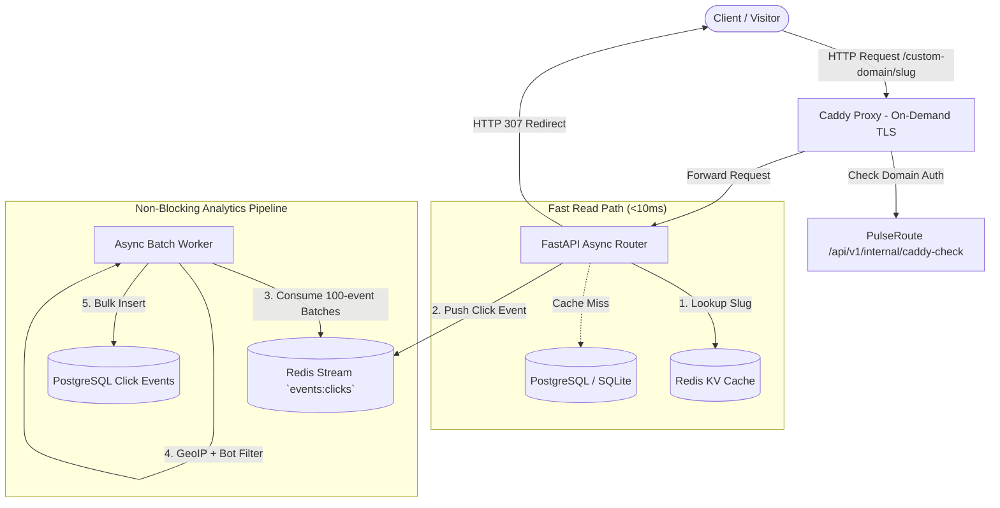

<div align="center">

# ⚡ PulseRoute

**Enterprise-Grade URL Shortener, Custom Domains & Real-Time Analytics Platform**

[](https://github.com/dixtuel/pulseroute/actions)
[](https://github.com/codespaces)
[](https://dixtuel.github.io/pulseroute)
[](LICENSE)
[](https://www.python.org/)

*Sub-10ms redirects, automated Caddy On-Demand TLS for custom domains, distributed Base62 ID generation, non-blocking Redis Stream analytics ingestion, and an embedded modern web dashboard & rich terminal CLI.*

[✨ Live GitHub Pages Demo](https://dixtuel.github.io/pulseroute) • [🚀 1-Click Codespaces](#-1-click-github-codespaces-instant-demo) • [📖 Architecture](#-system-architecture) • [💻 CLI Guide](#-rich-terminal-cli)

---

</div>

## 📌 Why PulseRoute?

PulseRoute bridges the gap between lightweight hobby shorteners and heavyweight enterprise SaaS (like Bitly and Dub.co). It is built for developers, marketing teams, and infrastructure engineers who demand **complete data ownership**, **lightning-fast redirection speeds**, and **zero-friction custom domain onboarding**.

### Key Highlights:
- ⚡ **Ultra-Fast Redirects (<10ms):** Redis Cache-Aside with Singleflight distributed locking and negative caching against cache stampede attacks.
- 🌐 **Custom Domains & Zero-Config SSL:** Native Caddy On-Demand TLS integration (`/api/v1/internal/caddy-check`) with DNS TXT/CNAME validation.
- 📊 **Asynchronous Non-Blocking Analytics:** Ingests clicks instantly into Redis Streams (`XADD`), batch-consumed by async workers into PostgreSQL with GeoIP and Bot detection.
- 📱 **Smart Device Deep-Linking:** Automatically route iOS users to the App Store, Android users to Google Play, and Desktop users to your landing page.
- 🛡️ **3 Configurable Deployment Modes:** 
  - `MODE=private`: Enterprise & internal SMS/CRM tool.
  - `MODE=public`: Community shortener with sliding-window rate limiting & malware blocklists.
  - `MODE=multi_tenant`: Agency SaaS with isolated workspaces, domain-scoped slugs, and quotas.
- 💻 **Rich Terminal CLI & Embedded Dashboard:** Control everything from a colorful terminal UI or the included SPA web panel.

---

## 🏛️ System Architecture



---

## 🚀 1-Click GitHub Codespaces (Instant Demo)

Try PulseRoute directly in your browser without installing anything on your machine:

1. Click [](https://github.com/codespaces)
2. Once the environment boots, run:
   ```bash
   pulseroute serve
   ```
3. Open `http://localhost:8000/dashboard` in the forwarded ports tab.

---

## 💻 Rich Terminal CLI

PulseRoute comes equipped with a first-class CLI powered by **Typer** and **Rich**:

```bash
# Start server and dashboard
pulseroute serve --port 8000

# Shorten a URL with custom slug and print an ASCII QR Code
pulseroute link create https://github.com/dixtuel/pulseroute --slug gh-repo --qr

# List all active links in a formatted table
pulseroute link list

# Add & verify custom domains
pulseroute domain add links.mybrand.com
pulseroute domain verify links.mybrand.com

# Inspect global analytics
pulseroute analytics summary --days 7
```

---

## 🐳 Production Deployment (Docker Compose)

Deploy the full production stack (FastAPI + PostgreSQL + Redis + Caddy with automatic SSL) in one command:

```bash
git clone https://github.com/dixtuel/pulseroute.git
cd pulseroute/deploy
cp .env.example .env
docker compose up -d
```

---

## 🧪 Testing & Quality Assurance

Run the comprehensive unit and integration test suite:

```bash
# Run tests with coverage
pytest --cov=pulseroute -v

# Run linting
ruff check src/ tests/
```

---

## 📄 License

This project is licensed under the MIT License - see the [LICENSE](LICENSE) file for details.
